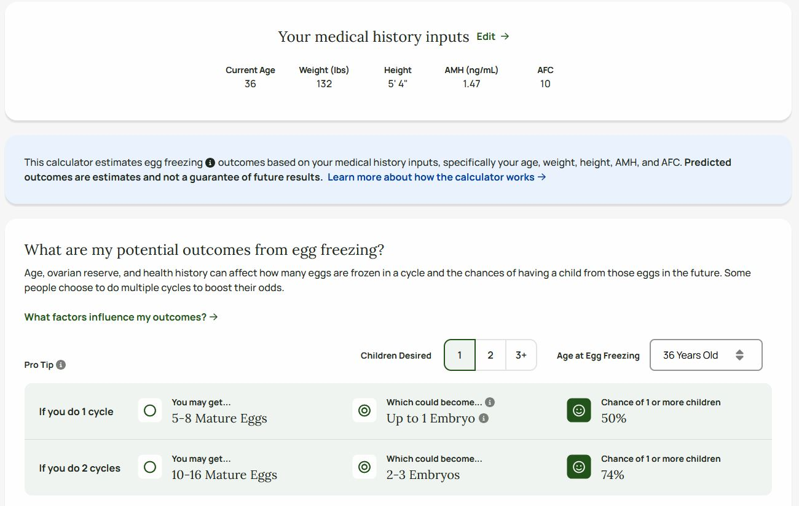

```{r setup, include=FALSE}
knitr::opts_chunk$set(echo = F)
library(dplyr)
library(ggplot2)
library(VGAM)
library(pROC)
library(ResourceSelection)
library(knitr)
library(tidyr)
set.seed(123)
```

```{r define_functions}
source(file.path(here::here(),"R/utils/modeling_stats_utility_functions.R"))
```

```{r read_in_and_clean_cycle_data, include=F}
df <- readr::read_rds("data/clean_data/cld_filtered.rds") |> 
  dplyr::rename(pregnant = pregnant_bool)

df <- df %>%
  mutate(age_group = case_when(
    age < 35 ~ "<35",
    age >= 35 & age <= 37 ~ "35-37",
    age >= 38 & age <= 40 ~ "38-40",
    age >= 41 ~ "41+"
  ))

df$age_group <- as.factor(df$age_group)

# Number of unique PAT ids
df = df |> dplyr::mutate(the_year = lubridate::year(treatment_start_date))
```

# Descriptive Statistics {.tabset}

## Number of Unique Patients

```{r}
df |> 
  dplyr::select(pat_id, age_group) |> 
  dplyr::distinct() |> 
  dplyr::count(age_group) |> 
  knitr::kable()
```

## Descriptive Pregnancy Rates

```{r}
pregnancy_rates <- df %>%
  group_by(age_group) %>%
  summarize(
    cycles = n(),
    pregnancies = sum(pregnant),
    pregnancy_rate = pregnancies / cycles
  )

kable(pregnancy_rates, digits = 3)

ggplot(pregnancy_rates, aes(x = age_group, y = pregnancy_rate)) +
  geom_col() +
  labs(
    title = "Pregnancy Rate by Age Group",
    x = "Age Group",
    y = "Pregnancy Rate"
  )
```

## Dataset Date Range
```{r}
df |> 
  dplyr::reframe(earliest_date = min(treatment_start_date, na.rm=T),
                 latest_date = max(treatment_start_date, na.rm=T)) |> 
  knitr::kable()

df |> 
  dplyr::mutate(year = lubridate::year(treatment_start_date)) |> 
  dplyr::count(year, name = 'unique patient/treatment cycle combinations')

ggplot(df) + 
  geom_histogram(aes(treatment_start_date)) + 
  scale_x_date(date_breaks = 'year', date_labels = '%Y') +
  theme_minimal()
```

## Key Variables
```{r make_tbl_for_key_variables}
# Filter dataset for people with frozen eggs.
# key_var_summary = df |> 
#   dplyr::mutate(total_2pn_eggs = num_2pn_from_fresh_eggs + num_2pn_from_frozen_eggs) |> 
#   dplyr::group_by(age_group) |> 
#   dplyr::reframe(
#     dplyr::across(
#       .cols = c(bmi, age, amh, afc, num_euploid_blast, num_eggs_collected, num_m2_eggs, total_2pn_eggs),
#       \(x) median(x,na.rm=T),.names = "median_{.col}"
#     )
#   )
var_summary <- df %>%
  mutate(
    total_2pn_eggs = num_2pn_from_fresh_eggs + num_2pn_from_frozen_eggs
  ) %>%
  group_by(age_group) %>%
  summarise(
    n_cycles = n(),
    
    # Euploid embryos
    mean_euploid    = mean(num_euploid_blast, na.rm = TRUE),
    iqr_euploid_l   = quantile(num_euploid_blast, 0.25, na.rm = TRUE),
    iqr_euploid_u   = quantile(num_euploid_blast, 0.75, na.rm = TRUE),
    pct_ge1_euploid = mean(coalesce(num_euploid_blast, 0) >= 1) * 100,
    
    # Eggs retrieved
    mean_eggs       = mean(num_eggs_collected, na.rm = TRUE),
    iqr_eggs_l      = quantile(num_eggs_collected, 0.25, na.rm = TRUE),
    iqr_eggs_u      = quantile(num_eggs_collected, 0.75, na.rm = TRUE),
    
    # MII eggs
    mean_m2         = mean(num_m2_eggs, na.rm = TRUE),
    iqr_m2_l        = quantile(num_m2_eggs, 0.25, na.rm = TRUE),
    iqr_m2_u        = quantile(num_m2_eggs, 0.75, na.rm = TRUE),
    
    # Fertilized (2PN)
    mean_2pn        = mean(total_2pn_eggs, na.rm = TRUE),
    iqr_2pn_l       = quantile(total_2pn_eggs, 0.25, na.rm = TRUE),
    iqr_2pn_u       = quantile(total_2pn_eggs, 0.75, na.rm = TRUE),
    
    # AMH
    mean_amh        = mean(amh, na.rm = TRUE),
    iqr_amh_l       = quantile(amh, 0.25, na.rm = TRUE),
    iqr_amh_u       = quantile(amh, 0.75, na.rm = TRUE),
    
    # AFC
    mean_afc        = mean(afc, na.rm = TRUE),
    iqr_afc_l       = quantile(afc, 0.25, na.rm = TRUE),
    iqr_afc_u       = quantile(afc, 0.75, na.rm = TRUE),
    
    .groups = "drop"
  )


var_summary_fmt <- var_summary %>%
  mutate(
    eggs_fmt = sprintf("%.1f (%.1f–%.1f)", mean_eggs, iqr_eggs_l, iqr_eggs_u),
    m2_fmt   = sprintf("%.1f (%.1f–%.1f)", mean_m2, iqr_m2_l, iqr_m2_u),
    p2n_fmt  = sprintf("%.1f (%.1f–%.1f)", mean_2pn, iqr_2pn_l, iqr_2pn_u),
    amh_fmt  = sprintf("%.2f (%.2f–%.2f)", mean_amh, iqr_amh_l, iqr_amh_u),
    afc_fmt  = sprintf("%.1f (%.1f–%.1f)", mean_afc, iqr_afc_l, iqr_afc_u),
    euploid_fmt = sprintf("%.1f (%.1f–%.1f)", mean_euploid, iqr_euploid_l, iqr_euploid_u),
    euploid_pct = sprintf("%.1f%%", pct_ge1_euploid)
  )

var_summary_fmt |> 
  knitr::kable()
```

# Patient-level Statistical Models {.tabset}

Note - models in this section include only treatments of type 'ICSI' (the majority of the treatments) and NOT those of type 'IVF'.

```{r}
m1df = df |> 
  dplyr::filter(treatment == 'ICSI')
```

This filter reduces the number of rows of data in this cycle-level table from `r nrow(df)` to `r nrow(m1df)`.

## Binomial Logistic Model {.tabset}

### Just by Age group

The model is this:

$pregant \sim agegroup$

```{r}
logit_model <- glm(
  pregnant ~ age,
  family = binomial(link = "logit"),
  data = m1df
)

validate_model(logit_model, data = m1df, 'pregnant')

logit_summary <- summary(logit_model)$coefficients
kable(logit_summary, digits = 3)
```

```{r}
# ### Multiple Predictor Variables
# 
# The model is this:
# 
# $pregant \sim agegroup + amh + afc+ bmi$
#   
# logit_model_more_vars <- glm(
#   pregnant ~ age + amh + afc + bmi,
#   family = binomial(link = "logit"),
#   data = m1df
# )
# 
# logit_more_vars_summary <- summary(logit_model_more_vars)$coefficients
# kable(logit_more_vars_summary, digits = 3)
```

### With Infertility Diagnosis
```{r}
logit_model_infert <- glm(
  pregnant ~ age + primary_infertility_diagnosis_cl,
  family = binomial(link = "logit"),
  data = m1df
)

logit_infert_summary <- summary(logit_model_infert)$coefficients

kable(logit_infert_summary, digits = 3)

# make_sig_primary_infert_tbl = function(dat){
#   the_row_names = row.names(logit_infert_summary)
#   
#   logit_infert_summary = logit_infert_summary |> 
#     tidyr::as_tibble()
#   
#   logit_infert_summary |> 
#     dplyr::mutate(var_name = the_row_names) |> 
#     # dplyr::filter(`Pr(>|z|)` <= 0.05) |> 
#     dplyr::mutate(var_name = stringr::str_remove_all(var_name,".*_cl")) |> 
#     dplyr::filter(!var_name %in% c('age','(Intercept)'))
# }
# 
# m1_infert_sum_tbl = make_sig_primary_infert_tbl(logit_infert_summary)
# 
# m1_infert_sum_tbl |> knitr::kable()
```

## Predicted Probabilities

```{r}
predicted_probs <- m1df %>%
  distinct(age, primary_infertility_diagnosis_cl) %>%
  mutate(predicted_p = predict(logit_model, newdata = ., type = "response")#,
         # predicted_p_infert = predict(logit_model_infert, newdata = ., type = "response")
         ) |> 
  dplyr::arrange(age)

# # Try this for equation with more predictor vars
# predicted_probs_more_vars = m1df %>%
#   dplyr::distinct(age, bmi, amh, afc) %>%
#   dplyr::filter(!is.na(afc)) %>%
#   mutate(predicted_p = predict(logit_model_more_vars, newdata = ., type = "response")) |>
#   dplyr::arrange(age)

# Regroup predicted probabilities
predicted_probs |> 
  summarise_to_age_classes('predicted_p') |> 
  knitr::kable()

# Data table below shows predicted probabilities
# predicted_probs |> 
#   # Filter for just those diagnoses with significant result
#   dplyr::filter(primary_infertility_diagnosis_cl %in% m1_infert_sum_tbl[m1_infert_sum_tbl$`Pr(>|z|)` <= 0.05,]$var_name) |> 
#   dplyr::group_by(primary_infertility_diagnosis_cl) |> 
#   dplyr::group_split() |> 
#   purrr::map( ~ {
#     primary_infertility_diagnosis_cl = unique(.x$primary_infertility_diagnosis_cl)
#     summarise_to_age_classes(.x, 'predicted_p_infert') |> 
#       dplyr::mutate(primary_infertility_diagnosis_cl)
#   }) |> 
#   dplyr::bind_rows() |> 
#   DT::datatable()

# ggplot(predicted_probs_frozen) + geom_histogram(aes(predicted_p))

# kable(predicted_probs, digits = 3)
# kable(predicted_probs_more_vars, digits = 3)
predicted_probs |> 
  summarise_to_age_classes('predicted_p') |> 
  ggplot(aes(x = age_group)) +
  geom_point(size = 3, aes(y = predicted_p_mean)) +
  geom_line(aes(group = 1, y = predicted_p_mean)) +
  labs(
    title = "Mean Predicted Probability of Pregnancy by Age Group",
    x = "Age Group",
    y = "Predicted Probability"
  ) + 
  theme_minimal()
```

## Compare Results with Branch's Calculator

Here are the inputs we used for Branch Calculator:



Here are the predicted probabilities based on our cycle-level dataset, using this model

$pregant \sim agegroup + amh + afc+ bmi$

```{r}

# one_cycle_probs = predicted_probs_frozen |> 
#   dplyr::group_by(age_group) |> 
#   dplyr::reframe(median_predicted_prob = median(predicted_p,na.rm=T))

N <- 1

one_cycle_probs <- predicted_probs %>%
  mutate(
    success_N_cycles = 1 - (1 - predicted_p)^N,
    failure_N_cycles = (1 - predicted_p)^N
  )

N <- 2

two_cycle_probs <- predicted_probs %>%
  mutate(
    success_N_cycles = 1 - (1 - predicted_p)^N,
    failure_N_cycles = (1 - predicted_p)^N
  )

one_cycle_tbl = one_cycle_probs |> 
  dplyr::group_by(age) |> 
  dplyr::reframe(median_predicted_prob = mean(success_N_cycles,na.rm=T)) |> 
  dplyr::mutate(cycle_attempts = 1)
  
two_cycle_tbl = two_cycle_probs |> 
  dplyr::group_by(age) |> 
  dplyr::reframe(median_predicted_prob = mean(success_N_cycles,na.rm=T)) |> 
  dplyr::mutate(cycle_attempts = 2)

one_cycle_tbl |> 
  summarise_to_age_classes("median_predicted_prob") |> 
  dplyr::mutate(cycle_attempts = 1) |> 
  dplyr::bind_rows(
    two_cycle_tbl |> 
      summarise_to_age_classes("median_predicted_prob") |> 
      dplyr::mutate(cycle_attempts = 2)
) |> 
  knitr::kable()
```

## Multi-Cycle Success (Insurance View)

```{r}
# One cycle 
N <- 3

multi_cycle <- predicted_probs %>%
  mutate(
    success_N_cycles = 1 - (1 - predicted_p)^N,
    failure_N_cycles = (1 - predicted_p)^N
  )

multi_cycle |> 
  summarise_to_age_classes('predicted_p') |>
  kable(digits = 3)

multi_cycle |> 
  summarise_to_age_classes('success_N_cycles') |> 
  ggplot(aes(x = age_group, y = success_N_cycles_mean)) +
  geom_col() +
  labs(
    title = paste("Probability of Success Within", N, "Cycles"),
    x = "Age Group",
    y = "Success Probability"
  )
```

## Attempt-Level Modeling

```{r}
df_attempt_recalc <- m1df |> 
  dplyr::group_by(pat_id) |> 
  dplyr::arrange(treatment_start_date) |> 
  dplyr::mutate(attempt_num = dplyr::row_number()) |> 
  dplyr::ungroup()

attempt_model <- glm(
  pregnant ~ age + attempt_num,
  family = binomial,
  data = df_attempt_recalc
)

attempt_summary <- summary(attempt_model)$coefficients
kable(attempt_summary, digits = 3)
```

## Predicted Probability by Attempt

```{r}
attempt_predictions <- expand.grid(
  age = unique(m1df$age),
  attempt_num = 1:3
)

attempt_predictions$predicted_p <- predict(
  attempt_model,
  newdata = attempt_predictions,
  type = "response"
)

attempt_predictions = attempt_predictions |> 
  dplyr::group_by(attempt_num) |> 
  dplyr::mutate(the_attempt_num = attempt_num) |> 
  dplyr::group_split() |> 
  purrr::map( ~ {
    attempt_num = unique(.x$the_attempt_num)
    summarise_to_age_classes(.x, 'predicted_p') |> 
      dplyr::mutate(attempt_num)
  }) |> 
  dplyr::bind_rows()

kable(attempt_predictions, digits = 3)

ggplot(attempt_predictions, aes(x = attempt_num, y = predicted_p_mean, color = age_group)) +
  geom_line() +
  geom_point() +
  labs(
    title = "Mean Predicted Probability by Attempt Number",
    x = "Attempt Number",
    y = "Predicted Probability",
    color = "Age Group"
  )

attempt_predictions %>% readr::write_csv("outputs/attempt_probabilities_by_age_long.csv")

attempt_predictions_wide <- attempt_predictions %>% 
  tidyr::pivot_wider(names_from = attempt_num, values_from = predicted_p_mean)

attempt_predictions_wide %>% readr::write_csv("outputs/attempt_probabilities_by_age_wide.csv")
```

## Multi-cycle with Varying Probabilities

```{r}
# Use p1, p2, p3 instead of assuming constant probability

multi_cycle_dynamic <- attempt_predictions %>%
  group_by(age_group) %>%
  summarize(
    success_prob = 1 - prod(1 - predicted_p_mean),
    failure_prob = prod(1 - predicted_p_mean)
)

multi_cycle_dynamic |> 
  knitr::kable()

```

## Binomial Model (Actuarial model)

```{r}
# Account for patient heterogeneity and overdispersion

# First aggregate to patient level
patient_summary <- m1df %>%
  group_by(pat_id, age, age_group) %>%
  summarize(
    attempts = n(),
    successes = as.integer(sum(pregnant)),
    .groups = "drop"
)

# table(patient_summary$age) |> knitr::kable()

binom_mod = run_binomial_model_with_various_distributions(patient_summary, formula = "cbind(successes, attempts - successes) ~ age") |> 
  suppressMessages()

print("Here is the full model validation output:")

validate_model(binom_mod, data = patient_summary, outcome_var = 'successes')

summary(binom_mod)

# Convert to dataframe.
mod1_binom_model_summary = coef(summary(binom_mod)) |> 
  as.data.frame()

```

<!-- ## Extract Beta Parameters -->

```{r}
# # Retrieve alpha and beta (shape parameters)
# if(!is.null(mod1_binom_model_summary)){
#   coef_qb <- coef(binom_mod)
# 
#   print(coef_qb)
# } else {
#   print("No coefficients can be extracted from binomial model due to above-noted model failure")
#   coef_qb = NULL
# }

```

```{r}
# # Simulate distribution of success probabilities
# set.seed(123)
# 
# sim_results <- patient_summary %>%
#   rowwise() %>%
#   mutate(
#     simulated_p = rbeta(1, shape1 = 2, shape2 = 5), # example params
#     success_sim = rbinom(1, size = attempts, prob = simulated_p)
# )
# 
# sim_results |> 
#   DT::datatable()
```

```{r}
patient_summary <- patient_summary |>
  dplyr::mutate(
    pred_p = predict(binom_mod, newdata = patient_summary, type = "response"),
    prob_achieve_pregnancy = 1 - (1 - pred_p)
  )

# Simulate outcomes per patient
set.seed(123)

pregnancy_sim_results <- patient_summary |>
  dplyr::rowwise() |>
  dplyr::mutate(
    success_sim = rbinom(1, size = 1, prob = pred_p),
    achieve_pregnancy_sim = success_sim >= 1
  ) |>
  dplyr::ungroup()

print("The following table represents predicted successes or failures at the unique pat_id level based on the clinical pregnancy binomial model.")

pregnancy_sim_results |> 
  DT::datatable()

```

### Simulated Probabilities averaged by Age Group
```{r}
pregnancy_sim_results |> 
  dplyr::group_by(age_group) |> 
  dplyr::reframe(
    pct_achieve_pregnancy_sim = mean(achieve_pregnancy_sim, na.rm = TRUE)
  ) |> 
  dplyr::arrange(age_group) |> 
  knitr::kable()
```

# Egg Actuarial Model (Beta-binomial / Binomial + Monte-Carlo Simulation) {.tabset}

The following statistics are based on these values:

-   cost per cycle: \$22,014

-   payout amount: \$17,611

-   risk margin: 0.2

-   admin load: 0.1

```{r read_in_egg_dataframe_and_clean_it, include = F}

# I'm unsure if we NEED to read in a new copy of the structured egg table... but if we do, we follow the same cleaning steps as above.
egg_df = readr::read_rds("data/clean_data/cleaned_egg_level_df.rds")

# Zoom in on relevant rows, drop rows with no info for age and attempt.
egg_df = egg_df |> 
  dplyr::select(pat_id, egg_id, age, attempt, pgd_clinresult, frozen_embryo, frozen_egg) |> 
  dplyr::filter(!is.na(age))

# Calculate age_group
egg_df = egg_df |> 
  dplyr::mutate(age_group = case_when(
    age < 35 ~ "<35",
    age >= 35 & age <= 37 ~ "35-37",
    age >= 38 & age <= 40 ~ "38-40",
    age >= 41 ~ "41+"
  )
)

# Add treatment course ID and cycle number ID columns
df = df |> 
  dplyr::arrange(pat_id, treatment_start_date) |>
  dplyr::group_by(pat_id) |>
  dplyr::mutate(
    gap_days = as.numeric(treatment_start_date - dplyr::lag(treatment_start_date)),
    new_treat_course = ifelse(is.na(gap_days) | gap_days > 365, 1, 0),
    treat_course_id = cumsum(new_treat_course)
  ) |> 
  dplyr::select(-c(gap_days,new_treat_course)) |> 
  # Define cycle number within a treatment course
  dplyr::group_by(pat_id, treat_course_id) |>
  dplyr::arrange(treatment_start_date) |>
  # Cycle number is the key column we're making here - within a given 'treat_course', 
  # we can have various related cycles (cycle 1, 2, etc.)
  dplyr::mutate(cycle_number = dplyr::row_number()) |> 
  dplyr::ungroup()

cost_per_cycle <- 22014
payout_amount <- 17611
risk_margin <- 0.20
admin_load <- 0.10

n_sim <- 5000 # Monte Carlo iterations

```

## Euploid Embryo Model (Binomial) {.tabset}

### Model Outputs

```{r}
############################################################
# 1. EUPLOID EMBRYO MODEL (BINOMIAL)
############################################################

# Aggregate structured egg table to patient-level counts
euploid_summary <- egg_df |>
  dplyr::filter(!frozen_egg) |>
  dplyr::mutate(
    success = pgd_clinresult %in% c("Euploid", "Normal") & !is.na(pgd_clinresult)
  ) |>
  dplyr::group_by(pat_id) |>
  dplyr::reframe(
    successes = sum(success),
    number_of_eggs_attempted = dplyr::n(),
    age = median(age, na.rm = TRUE),
    age_group = dplyr::first(age_group)
  )

# Fit binomial model for per-egg euploid probability as a function of age
euploid_binom_model <- glm(
  cbind(successes, number_of_eggs_attempted - successes) ~ age,
  family = quasibinomial,
  data = euploid_summary
)

validate_model(euploid_binom_model, euploid_summary, 'successes')

# Save coefficient summary
euploid_model_summary <- coef(summary(euploid_binom_model)) |>
  as.data.frame()

# Add predicted probabilities
euploid_summary <- euploid_summary |>
  dplyr::mutate(
    pred_p = predict(euploid_binom_model, newdata = euploid_summary, type = "response"),
    prob_ge1_euploid = 1 - (1 - pred_p)^number_of_eggs_attempted
  )

# Simulate outcomes per patient
set.seed(123)

euploid_sim_results <- euploid_summary |>
  dplyr::rowwise() |>
  dplyr::mutate(
    success_sim = rbinom(1, size = number_of_eggs_attempted, prob = pred_p),
    ge1_euploid_sim = success_sim >= 1
  ) |>
  dplyr::ungroup()

# # Plot predicted per-egg probabilities from the model
# euploid_summary |>
#   ggplot(aes(x = pred_p)) +
#   geom_histogram(bins = 30) +
#   labs(
#     x = "Predicted Per-Egg Euploid Probability",
#     title = "Distribution of Predicted Probabilities"
#   ) +
#   theme_minimal()

euploid_sim_results |>
  DT::datatable()
```

### Simulated Probabilities averaged by Age Group
```{r}
euploid_sim_results |> 
  dplyr::group_by(age_group) |> 
  dplyr::reframe(
    pct_1_plus_euploid_sim = mean(ge1_euploid_sim, na.rm = TRUE)
  ) |> 
  dplyr::arrange(age_group) |> 
  knitr::kable()
```

### Model with Primary Infertility Diagnosis Added - Model Outputs
```{r}
euploid_summary = egg_df |>
  dplyr::mutate(success = pgd_clinresult %in% c("Euploid","Normal") & !is.na(pgd_clinresult)) |> 
  group_by(pat_id) |>
  summarise(
    successes = sum(success),
    number_of_eggs_attempted = n(),
    age = first(age),
    age_group = first(age_group),
    .groups = "drop"
  ) |> 
  dplyr::left_join(df |> dplyr::select(pat_id, primary_infertility_diagnosis_cl), by = dplyr::join_by(pat_id)) |> 
  dplyr::filter(!is.na(primary_infertility_diagnosis_cl))

euploid_binom_model = glm(
  cbind(successes, number_of_eggs_attempted - successes) ~ age + primary_infertility_diagnosis_cl,
  family = binomial,
  data = euploid_summary
)

validate_model(euploid_binom_model, euploid_summary, 'successes')

euploid_model_summary = coef(summary(euploid_binom_model)) |>
  as.data.frame()

coef_euploid <- coef(euploid_binom_model)

alpha <- exp(coef_euploid[1])
beta <- exp(coef_euploid[2])

# validate_model(euploid_binom_model, euploid_summary, "successes")

# Add probabilities to egg_df

euploid_p = rbeta(n_sim, alpha, beta)

euploid_costs <- run_simulation(euploid_p, cost_per_cycle, payout_amount, n_sim)

# data.frame(pred_probs = euploid_p) |>
#   ggplot() +
#   geom_histogram(aes(pred_probs)) + 
#   labs(x = "Simulated Probability", title = paste0("Simulated Probabilities with Monte-Carlo: ",n_sim," simulation runs")) + 
#   theme_minimal()

# Add predicted probabilities
euploid_summary <- euploid_summary |>
  dplyr::mutate(
    pred_p = predict(euploid_binom_model, newdata = euploid_summary, type = "response"),
    prob_ge1_euploid = 1 - (1 - pred_p)^number_of_eggs_attempted
  )

# Simulate outcomes per patient
set.seed(123)

euploid_sim_results <- euploid_summary |>
  dplyr::rowwise() |>
  dplyr::mutate(
    success_sim = rbinom(1, size = number_of_eggs_attempted, prob = pred_p),
    ge1_euploid_sim = success_sim >= 1
  ) |>
  dplyr::ungroup()

print("The following table represents predicted successes or failures at the unique pat_id level based on the euploid binomial model.")

euploid_sim_results |> 
  DT::datatable()

```

### Simulated Probabilities averaged by Age Group with Primary Inf Diagnosis
```{r}
euploid_sim_results |> 
  dplyr::group_by(primary_infertility_diagnosis_cl,age_group) |> 
  dplyr::reframe(
    pct_1_plus_euploid_sim = mean(ge1_euploid_sim, na.rm = TRUE)
  ) |> 
  dplyr::arrange(primary_infertility_diagnosis_cl,age_group) |> 
  knitr::kable()
```

## Single-cycle Egg Model (Binomial model) {.tabset}

```{r}
# Remove rows where amh is unknown.
df = df |> dplyr::filter(!is.na(amh))
```

### Model Outputs

Note: this model uses the patient / cycle-level table and does not currently filter away rows for eggs of cryo_day_2 or cryo_day_3; N of this dataframe is therefore `r nrow(df)`.

```{r}
threshold_single <- 7

single_cycle_egg_df <- df %>%
  filter(
    !is.na(age),
    !is.na(afc),
    !is.na(amh),
    !is.na(num_eggs_collected),
    !is.na(treatment_start_date)
  ) %>%
  arrange(pat_id, treatment_start_date) %>%
  group_by(pat_id) %>%
  slice(1) %>%
  ungroup() %>%
  mutate(
    success = as.numeric(num_eggs_collected >= threshold_single),
    
    # AMH bins
    amh_bin = case_when(
      amh < 0.5 ~ "Very low",
      amh >= 0.5 & amh < 1.0 ~ "Low",
      amh >= 1.0 & amh <= 3.0 ~ "Normal",
      amh > 3.0 ~ "High"
    ),
    
    amh_bin = factor(amh_bin, levels = c("Very low", "Low", "Normal", "High"))
  )

# Model
s_egg_model <- glm(
  success ~ age + afc + amh_bin,
  family = binomial,
  data = single_cycle_egg_df
)

validate_model(s_egg_model, single_cycle_egg_df, "success")

s_egg_model_summary <- coef(summary(s_egg_model)) %>%
  as.data.frame()

coef_s_egg <- coef(s_egg_model)

# Add predicted probabilities
single_cycle_egg_df <- single_cycle_egg_df %>%
  mutate(
    pred_p = predict(s_egg_model, newdata = single_cycle_egg_df, type = "response")
  )

# Simulate outcomes
set.seed(123)

s_egg_sim_results <- single_cycle_egg_df %>%
  mutate(
    success_sim = rbinom(n(), size = 1, prob = pred_p)
  )

s_egg_sim_results %>%
  DT::datatable()
```

### Simulated Probabilities averaged by Age Group
```{r}
s_egg_sim_results %>%
  group_by(age_group) %>%
  summarise(
    prob_success = mean(success_sim, na.rm = TRUE),
    .groups = "drop"
  ) %>%
  arrange(age_group) %>%
  knitr::kable()
```

### Model with Primary Infertility Diagnosis Added - Model Outputs
```{r}
single_cycle_egg_df <- df |> 
  dplyr::filter(!is.na(afc)) |> 
  mutate(success = ifelse(num_eggs_collected >= threshold_single, 1, 0)) |> 
  group_by(pat_id) |> 
  reframe(
    successes = as.numeric(sum(success) > 0),
    attempts  = dplyr::n(), # Each row in this table is a treatment cycle, so n() gives us the number of cycles per patient.
    age = first(age),
    age_group = first(age_group),
    amh = first(amh),
    afc = first(afc)
  ) |> 
  dplyr::left_join(df |> dplyr::select(pat_id, primary_infertility_diagnosis_cl), by = dplyr::join_by(pat_id)) |> 
  dplyr::filter(!is.na(primary_infertility_diagnosis_cl))

# If we fall back to a standard binomial model instead, it works:
s_egg_model = glm(
    successes ~ age + amh + afc,
    family = binomial,
    data = single_cycle_egg_df
  )

validate_model(s_egg_model, single_cycle_egg_df, 'successes')

s_egg_model_summary = coef(summary(s_egg_model)) |>
  as.data.frame()

# coef_s_egg <- coef(s_egg_model)
# 
# alpha <- exp(coef_s_egg[1])
# beta <- exp(coef_s_egg[2])

# validate_model(s_egg_model, single_cycle_egg_df, "successes")

# Add probabilities to egg_df

# s_egg_p = rbeta(n_sim, alpha, beta)
# 
# s_egg_costs <- run_simulation(s_egg_p, cost_per_cycle, payout_amount, n_sim)

# data.frame(pred_probs = s_egg_p) |>
#   ggplot() +
#   geom_histogram(aes(pred_probs)) + 
#   labs(x = "Simulated Probability", title = paste0("Simulated Probabilities with Monte-Carlo: ",n_sim," simulation runs")) + 
#   theme_minimal()

# Add predicted probabilities
single_cycle_egg_df <- single_cycle_egg_df |>
  dplyr::mutate(
    pred_p = predict(s_egg_model, newdata = single_cycle_egg_df, type = "response"),
    prob_seven_eggs_or_more = 1 - (1 - pred_p)^(1)
  )

# Simulate outcomes per patient
set.seed(123)

s_egg_sim_results <- single_cycle_egg_df |>
  dplyr::rowwise() |>
  dplyr::mutate(
    success_sim = rbinom(1, size = 1, prob = pred_p),
    prob_seven_eggs_or_more = success_sim >= 1
  ) |>
  dplyr::ungroup()

print("The following table represents predicted successes or failures at the unique pat_id level based on the single-cycle egg  binomial model.")

s_egg_sim_results |> 
  DT::datatable()

```

### Simulated Probabilities averaged by Age Group with Primary Inf Diagnosis
```{r}
s_egg_sim_results |> 
  dplyr::group_by(primary_infertility_diagnosis_cl,age_group) |> 
  dplyr::reframe(
    prob_success = mean(prob_seven_eggs_or_more, na.rm = TRUE)
  ) |> 
  dplyr::arrange(primary_infertility_diagnosis_cl,age_group) |> 
  knitr::kable()
```

## Two-cycle Egg Model (Binomial model) {.tabset}

Note: this model includes only patients that have more than one treatment recorded in the dataset.
Note: this model assumes that treatments that occur within 365 days belong to a single treatment course, i.e. a collection of cycles including cycle 1, cycle 2, etc.; this assumption was necessary to compute this model because the dataset lacks a variable that otherwise links treatments across time. We could modify this assumption by removing this 365-day date proximity threshold, though this may incorrectly imply relatedness between distinct treatments performed by a patient across multiple years.

### Model Outputs

```{r}
threshold_two <- 15

# Keep patients with at least 2 cycles, then summarize first 2 cycles only
df_multiple <- df %>%
  filter(
    !is.na(age),
    !is.na(afc),
    !is.na(amh),
    !is.na(num_eggs_collected),
    !is.na(treatment_start_date)
  ) %>%
  arrange(pat_id, treatment_start_date) %>%
  group_by(pat_id) %>%
  mutate(cycle_order = row_number()) %>%
  filter(n() >= 2) %>%
  filter(cycle_order <= 2) %>%
  summarise(
    total_eggs_first2 = sum(num_eggs_collected, na.rm = TRUE),
    eggs_cycle1 = first(num_eggs_collected),
    age = first(age),
    age_group = first(age_group),
    amh = first(amh),
    afc = first(afc),
    attempts = n(),
    .groups = "drop"
  ) %>%
  mutate(
    successes = as.numeric(total_eggs_first2 >= threshold_two),
    amh_bin = case_when(
      amh < 0.5 ~ "Very low",
      amh >= 0.5 & amh < 1.0 ~ "Low",
      amh >= 1.0 & amh <= 3.0 ~ "Normal",
      amh > 3.0 ~ "High"
    ),
    amh_bin = factor(amh_bin, levels = c("Very low", "Low", "Normal", "High"))
  )

two_egg_model <- glm(
  successes ~ age + afc + amh_bin + eggs_cycle1,
  family = binomial,
  data = df_multiple
)

validate_model(two_egg_model, df_multiple, "successes")

two_egg_model_summary <- coef(summary(two_egg_model)) %>%
  as.data.frame()

# Add predicted probabilities
df_multiple <- df_multiple %>%
  mutate(
    pred_p = predict(two_egg_model, newdata = df_multiple, type = "response")
  )

# Simulate outcomes per patient
set.seed(123)

df_multiple_sim_results <- df_multiple %>%
  mutate(
    success_sim = rbinom(n(), size = 1, prob = pred_p)
  )

print("The following table represents predicted successes or failures at the unique pat_id level based on the two-cycle egg binomial model.")

df_multiple_sim_results %>%
  DT::datatable()
```

### Simulated Probabilities averaged by Age Group
```{r}
df_multiple_sim_results %>%
  group_by(age_group) %>%
  summarise(
    prob_fifteen_eggs_or_more_sim = mean(success_sim, na.rm = TRUE),
    .groups = "drop"
  ) %>%
  arrange(age_group) %>%
  knitr::kable()
```

### Model with Primary Infertility Diagnosis Added - Model Outputs
```{r}
df_multiple = df |> 
  dplyr::group_by(pat_id,primary_infertility_diagnosis_cl) |> 
  dplyr::mutate(number_treatments = dplyr::n()) |> 
  dplyr::ungroup() |> 
  dplyr::filter(number_treatments > 1) |> 
  dplyr::group_by(pat_id, treat_course_id, primary_infertility_diagnosis_cl) |>
  dplyr::reframe(
    total_eggs_in_treat_course = sum(num_eggs_collected),
    total_cycles_in_treat_course = max(cycle_number),
    # Pull out the number of eggs retrieved in cycle number 1
    eggs_cycle1 = num_eggs_collected[cycle_number == 1][1],
    age = dplyr::first(age),
    age_group = dplyr::first(age_group),
    amh = dplyr::first(amh),
    afc = dplyr::first(afc),
    attempts = dplyr::n()
  ) |>
  dplyr::mutate(successes = total_eggs_in_treat_course >= threshold_two) |> 
  dplyr::arrange(pat_id) |> 
  dplyr::filter(!is.na(primary_infertility_diagnosis_cl),
                !is.na(age),
                !is.na(afc),
                !is.na(amh))

# If we fall back to a standard binomial model instead, it works:
two_egg_model = glm(
    successes ~ age + amh + afc + primary_infertility_diagnosis_cl,
    family = binomial,
    data = df_multiple
  )

validate_model(two_egg_model, df_multiple, 'successes')

two_egg_model_summary = coef(summary(two_egg_model)) |>
  as.data.frame()

# coef_two_egg <- coef(two_egg_model)
# 
# alpha <- exp(coef_two_egg[1])
# beta <- exp(coef_two_egg[2])
# 
# # validate_model(two_egg_model, df_multiple, "successes")
# 
# # Add probabilities to egg_df
# 
# two_egg_p = rbeta(n_sim, alpha, beta)
# 
# two_egg_costs <- run_simulation(two_egg_p, cost_per_cycle, payout_amount, n_sim)
# 
# data.frame(pred_probs = two_egg_p) |>
#   ggplot() +
#   geom_histogram(aes(pred_probs)) + 
#   labs(x = "Simulated Probability", title = paste0("Simulated Probabilities with Monte-Carlo: ",n_sim," simulation runs")) + 
#   theme_minimal()

# Add predicted probabilities
df_multiple <- df_multiple |>
  dplyr::mutate(
    pred_p = predict(two_egg_model, newdata = df_multiple, type = "response"),
    prob_fifteen_eggs_or_more = 1 - (1 - pred_p)^(1)
  )

# Simulate outcomes per patient
set.seed(123)

df_multiple_sim_results <- df_multiple |>
  dplyr::rowwise() |>
  dplyr::mutate(
    success_sim = rbinom(1, size = 1, prob = pred_p),
    prob_fifteen_eggs_or_more = success_sim >= 1
  ) |>
  dplyr::ungroup()

# # Simulate results with egg dataframe.
# two_egg_sim_results <- df_multiple %>%
#   rowwise() %>%
#   mutate(
#     simulated_p = rbeta(1, alpha, beta), # example params
#     success_sim = rbinom(1, size = attempts, prob = simulated_p)
# )

df_multiple_sim_results |> 
  DT::datatable()

```

### Simulated Probabilities averaged by Age Group with Primary Inf Diagnosis
```{r}
df_multiple_sim_results |> 
  dplyr::group_by(primary_infertility_diagnosis_cl,age_group) |> 
  dplyr::reframe(
    prob_fifteen_eggs_or_more_sim = mean(success_sim, na.rm = TRUE)
  ) |> 
  dplyr::arrange(primary_infertility_diagnosis_cl,age_group) |> 
  knitr::kable()
```

```{r}
## Pricing Outputs

calc_pricing <- function(costs) {
  data.frame(
    expected_cost = mean(costs),
    var_95 = quantile(costs, 0.95),
    premium = mean(costs) * (1 + risk_margin + admin_load)
  )
}

# euploid_results <- calc_pricing(euploid_costs)
# egg_results <- calc_pricing(s_egg_costs)
# two_results <- calc_pricing(two_egg_costs)

```


```{r}

# ## Final Comparison
# 
# # final_results <- dplyr::bind_rows(
# #   euploid_results %>% dplyr::mutate(model = "Euploid"),
# #   egg_results %>% dplyr::mutate(model = "Single Egg"),
# #   egg_results_age_group %>% dplyr::mutate(model = "Single Egg (age group)"),
# #   two_egg_results %>% dplyr::mutate(model = "Two Cycle Egg"),
# #   two_egg_results_age_group %>% dplyr::mutate(model = "Two Cycle Egg (age group)"),
# # )
# # 
# # row.names(final_results) = NULL
# # 
# # final_results |> 
# #   knitr::kable()
# final_results <- bind_rows(
#   euploid_results %>% mutate(model = "Euploid"),
#   egg_results %>% mutate(model = "Single Egg"),
#   two_results %>% mutate(model = "Two Cycle Egg")
# )
# 
# row.names(final_results) = NULL
# 
# final_results = final_results |> 
#   dplyr::mutate(dplyr::across(-model, \(x) scales::dollar(x)))
# 
# knitr::kable(final_results)

############################################################
# END
############################################################
```

```{r put_results_in_excel_file}
# Create new workbook here in R
# my_wb = openxlsx::createWorkbook()
# 
# # Add worksheets / tabs to excel file.
# openxlsx::addWorksheet(my_wb, 'desc_preg_rates')
# openxlsx::addWorksheet(my_wb, 'binom_logist_model')
# openxlsx::addWorksheet(my_wb, 'pred_probabilities')
# openxlsx::addWorksheet(my_wb, 'multi_cycle_succ')
# openxlsx::addWorksheet(my_wb, 'atmpt_lvl_model')
# openxlsx::addWorksheet(my_wb, 'pred_prob_by_atmpt')
# openxlsx::addWorksheet(my_wb, 'multi_cycle_var_prob')
# openxlsx::addWorksheet(my_wb, 'quasi_binom_model')
# openxlsx::addWorksheet(my_wb, 'extract_params')
# openxlsx::addWorksheet(my_wb, 'simul_actuar_outcomes')
# openxlsx::addWorksheet(my_wb, 'insurance_metrics')
# openxlsx::addWorksheet(my_wb, 'final_comparison')
# 
# # Put results into each tab.
# openxlsx::writeData(my_wb, 'desc_preg_rates', pregnancy_rates)
# openxlsx::writeData(my_wb, 'binom_logist_model', logit_summary)
# openxlsx::writeData(my_wb, 'pred_probabilities', predicted_probs)
# openxlsx::writeData(my_wb, 'multi_cycle_succ', multi_cycle)
# openxlsx::writeData(my_wb, 'atmpt_lvl_model', attempt_summary)
# openxlsx::writeData(my_wb, 'pred_prob_by_atmpt', attempt_predictions)
# openxlsx::writeData(my_wb, 'multi_cycle_var_prob', multi_cycle_dynamic)
# openxlsx::writeData(my_wb, 'quasi_binom_model', quasi_binom_model_summary)
# openxlsx::writeData(my_wb, 'extract_params', coef_bb)
# openxlsx::writeData(my_wb, 'simul_actuar_outcomes', sim_results)
# openxlsx::writeData(my_wb, 'insurance_metrics', insurance_metrics)
# openxlsx::writeData(my_wb, 'final_comparison', final_results)
# 
# # Ensure each column is wide enough to hold its contents
# openxlsx::sheets(my_wb) |> 
#   purrr::iwalk( ~ {
#     openxlsx::setColWidths(my_wb, sheet = .x, cols = 1:10, widths = 'auto')
#   })
# 
# openxlsx::saveWorkbook(my_wb, file = "outputs/model_results.xlsx", overwrite = T)
```
